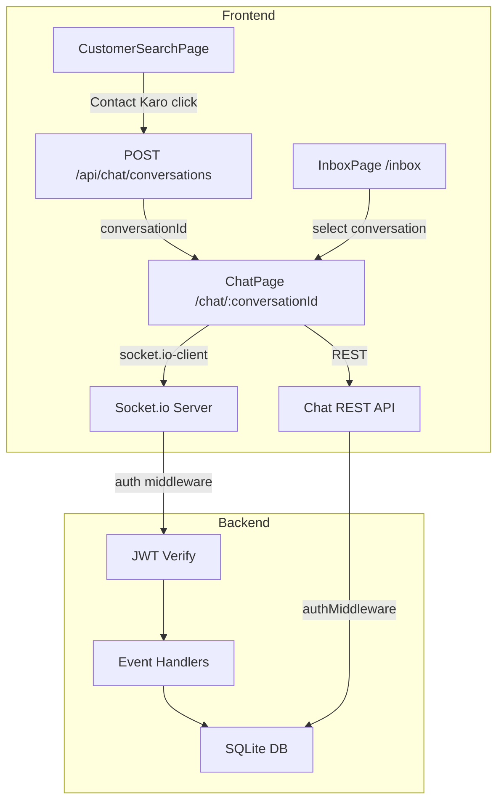

# Design Document: Real-Time Chat

## Overview

This feature adds a real-time messaging system to KaamlyTwo, enabling customers and workers to exchange text messages and photos within the app. The implementation integrates Socket.io into the existing Express server (`index.js`), adds two new SQLite tables (`conversations`, `messages`), exposes REST endpoints for conversation/message management, and introduces two new React pages (`InboxPage`, `ChatPage`).

The design follows the existing codebase patterns: CommonJS on the backend, inline styles on the frontend, JWT from `localStorage` for auth, and `multer` for file uploads.

---

## Architecture



**Key decisions:**
- Socket.io is attached to the existing `http.Server` wrapping the Express `app` in `index.js`. The current code calls `app.listen()`; this will be changed to `http.createServer(app)` + `new Server(httpServer)`.
- REST handles conversation creation, history loading (paginated), and photo uploads. Socket.io handles real-time message delivery only.
- JWT is passed in the Socket.io handshake `auth` object (`socket.handshake.auth.token`) and verified on `connection`.

---

## Components and Interfaces

### Backend

#### `src/index.js` (modified)
- Replace `app.listen()` with `http.createServer(app)` + `httpServer.listen()`.
- Instantiate `socket.io` Server with CORS matching existing config.
- Mount `initSocketServer(io)` from `src/socket/index.js`.
- Mount new route: `app.use('/api/chat', authMiddleware, require('./routes/chat'))`.

#### `src/socket/index.js` (new)
Exports `initSocketServer(io)`. Responsibilities:
- `io.use(socketAuthMiddleware)` — verify JWT from `socket.handshake.auth.token`, attach `socket.user`.
- `connection` handler:
  - `join_conversation` — verify user is a participant, call `socket.join(roomId)`.
  - `send_message` — validate body, verify participant, persist to DB, emit `new_message` to room.
  - `mark_read` — mark all messages in conversation as read for this user.
  - `disconnect` — cleanup (Socket.io handles room leave automatically).

#### `src/middleware/socketAuth.js` (new)
```js
// Verifies socket.handshake.auth.token, attaches socket.user
```

#### `src/routes/chat.js` (new)
All routes require `authMiddleware` (mounted at parent level).

| Method | Path | Description |
|--------|------|-------------|
| POST | `/api/chat/conversations` | Create or get existing conversation between auth user and `worker_id` (or `customer_id`) |
| GET | `/api/chat/conversations` | List all conversations for auth user (inbox) |
| GET | `/api/chat/conversations/:id/messages` | Paginated message history (`?before=<messageId>&limit=50`) |
| POST | `/api/chat/conversations/:id/messages/photo` | Upload photo message via multer |

#### `src/db/init.js` (modified)
Add two new tables to the `db.exec()` call:

```sql
CREATE TABLE IF NOT EXISTS conversations (
  id INTEGER PRIMARY KEY AUTOINCREMENT,
  customer_id INTEGER NOT NULL,
  worker_id INTEGER NOT NULL,
  created_at TEXT NOT NULL DEFAULT (datetime('now')),
  updated_at TEXT NOT NULL DEFAULT (datetime('now')),
  UNIQUE(customer_id, worker_id),
  FOREIGN KEY (customer_id) REFERENCES users(id) ON DELETE CASCADE,
  FOREIGN KEY (worker_id) REFERENCES users(id) ON DELETE CASCADE
);

CREATE TABLE IF NOT EXISTS messages (
  id INTEGER PRIMARY KEY AUTOINCREMENT,
  conversation_id INTEGER NOT NULL,
  sender_id INTEGER NOT NULL,
  type TEXT NOT NULL DEFAULT 'text',   -- 'text' | 'image'
  content TEXT,
  photo_path TEXT,
  is_read INTEGER NOT NULL DEFAULT 0,
  created_at TEXT NOT NULL DEFAULT (datetime('now')),
  FOREIGN KEY (conversation_id) REFERENCES conversations(id) ON DELETE CASCADE,
  FOREIGN KEY (sender_id) REFERENCES users(id) ON DELETE CASCADE
);

CREATE INDEX IF NOT EXISTS idx_messages_conversation ON messages(conversation_id);
CREATE INDEX IF NOT EXISTS idx_conversations_customer ON conversations(customer_id);
CREATE INDEX IF NOT EXISTS idx_conversations_worker ON conversations(worker_id);
```

### Frontend

#### `src/services/chatService.ts` (new)
Wraps all REST calls to `/api/chat/*` using the existing `apiClient`.

#### `src/socket/chatSocket.ts` (new)
Singleton Socket.io client. Reads JWT from `localStorage` for handshake auth. Exports `connect()`, `disconnect()`, `joinConversation(id)`, `sendMessage(conversationId, content)`, `onNewMessage(cb)`, `markRead(conversationId)`.

#### `src/pages/InboxPage.tsx` (new)
Route: `/inbox`. Lists all conversations for the authenticated user. Each row shows: other participant's name + photo, last message preview, unread badge, timestamp.

#### `src/pages/ChatPage.tsx` (new)
Route: `/chat/:conversationId`. Loads message history on mount, joins socket room, renders messages, handles send text + send photo. Shows connection status indicator.

#### `src/pages/CustomerSearchPage.tsx` (modified)
"Contact Karo" button calls `POST /api/chat/conversations` with the worker's `user_id`, then navigates to `/chat/:conversationId`.

#### `src/App.tsx` (modified)
Add routes:
```tsx
<Route path="/inbox" element={<InboxPage />} />
<Route path="/chat/:conversationId" element={<ChatPage />} />
```
Both inside `<ProtectedRoute>` + `<ProfileCompletionGuard>`.

---

## Data Models

### `conversations`

| Column | Type | Notes |
|--------|------|-------|
| id | INTEGER PK | Auto-increment |
| customer_id | INTEGER FK | References `users.id` |
| worker_id | INTEGER FK | References `users.id` |
| created_at | TEXT | ISO datetime |
| updated_at | TEXT | Updated on new message |

Unique constraint on `(customer_id, worker_id)` prevents duplicates.

### `messages`

| Column | Type | Notes |
|--------|------|-------|
| id | INTEGER PK | Auto-increment |
| conversation_id | INTEGER FK | References `conversations.id` |
| sender_id | INTEGER FK | References `users.id` |
| type | TEXT | `'text'` or `'image'` |
| content | TEXT | Nullable for image messages |
| photo_path | TEXT | Nullable for text messages |
| is_read | INTEGER | `0` = unread, `1` = read |
| created_at | TEXT | ISO datetime |

### Frontend Types (`src/types/chat.ts`)

```ts
export interface Conversation {
  id: number
  other_user: { id: number; name: string; photo_url: string | null }
  last_message: { content: string | null; type: 'text' | 'image'; created_at: string } | null
  unread_count: number
  updated_at: string
}

export interface Message {
  id: number
  conversation_id: number
  sender_id: number
  type: 'text' | 'image'
  content: string | null
  photo_url: string | null
  is_read: number
  created_at: string
}
```

### Socket.io Events

| Event | Direction | Payload |
|-------|-----------|---------|
| `join_conversation` | Client → Server | `{ conversationId: number }` |
| `send_message` | Client → Server | `{ conversationId: number, content: string }` |
| `new_message` | Server → Client | `Message` object |
| `mark_read` | Client → Server | `{ conversationId: number }` |
| `error` | Server → Client | `{ message: string }` |

---

## Correctness Properties

*A property is a characteristic or behavior that should hold true across all valid executions of a system — essentially, a formal statement about what the system should do. Properties serve as the bridge between human-readable specifications and machine-verifiable correctness guarantees.*

### Property 1: Conversation Idempotence

*For any* valid (customer_id, worker_id) pair, calling `POST /api/chat/conversations` any number of times should always return the same conversation ID and result in exactly one row in the `conversations` table.

**Validates: Requirements 1.2, 1.3**

---

### Property 2: Message Persistence Round-Trip

*For any* valid message (text or image) sent to a conversation, after the send operation completes the message should be retrievable from the database with all fields intact: `conversation_id`, `sender_id`, `type`, `content` or `photo_path`, and `created_at`.

**Validates: Requirements 2.2, 3.1, 4.3**

---

### Property 3: Whitespace and Length Validation

*For any* string composed entirely of whitespace characters (including empty string), the `send_message` handler SHALL reject it. Additionally, *for any* string exceeding 2000 characters, the handler SHALL reject it. *For any* non-empty string of length ≤ 2000 with at least one non-whitespace character, the handler SHALL accept it.

**Validates: Requirements 2.5, 2.6**

---

### Property 4: Photo Message Renders Inline

*For any* message object with `type === 'image'` and a non-null `photo_url`, the ChatPage message renderer should produce an `` element with the `src` set to that URL.

**Validates: Requirements 3.3**

---

### Property 5: File Upload Validation

*For any* file upload where the MIME type is not one of `image/jpeg`, `image/png`, `image/gif`, or `image/webp`, the upload endpoint SHALL return a 422 error. *For any* file upload where the file size exceeds 5MB, the upload endpoint SHALL return a 422 error.

**Validates: Requirements 3.4, 3.5**

---

### Property 6: Message History Ordering

*For any* conversation with one or more messages, the `GET /api/chat/conversations/:id/messages` endpoint SHALL return messages sorted by `created_at` ascending (oldest first).

**Validates: Requirements 4.1**

---

### Property 7: Pagination Limit

*For any* conversation with more than 50 messages, a single call to `GET /api/chat/conversations/:id/messages` SHALL return at most 50 messages.

**Validates: Requirements 4.4**

---

### Property 8: Inbox Ordering

*For any* user with two or more conversations, the `GET /api/chat/conversations` endpoint SHALL return conversations sorted by `updated_at` descending (most recently active first).

**Validates: Requirements 5.1**

---

### Property 9: Inbox Data Completeness

*For any* conversation returned by the inbox endpoint, the response object SHALL include: the other participant's `name`, `photo_url`, a `last_message` preview (or null if no messages), and an `unread_count`.

**Validates: Requirements 5.2, 5.3**

---

### Property 10: Unread Count Round-Trip

*For any* conversation where the recipient has unread messages, the `unread_count` in the inbox response SHALL be greater than zero. After the recipient emits `mark_read` for that conversation, a subsequent inbox fetch SHALL return `unread_count === 0` for that conversation.

**Validates: Requirements 5.3, 5.4**

---

### Property 11: Socket Authentication Rejects Invalid JWT

*For any* Socket.io connection attempt where the `handshake.auth.token` is missing, malformed, or expired, the Socket_Server SHALL reject the connection before any event handlers are registered.

**Validates: Requirements 6.1, 6.2**

---

### Property 12: Per-Message Authorization

*For any* `send_message` socket event where the `sender_id` is not a participant (`customer_id` or `worker_id`) of the target `conversationId`, the Socket_Server SHALL reject the event and emit an `error` event back to the sender without persisting or broadcasting the message.

**Validates: Requirements 6.3, 6.4**

---

## Error Handling

### Backend

| Scenario | HTTP / Socket Response |
|----------|----------------------|
| Missing/invalid JWT on REST | 401 `{ message: 'Unauthorized. Token required.' }` |
| Missing/invalid JWT on Socket connect | Socket connection rejected with `Error('Authentication error')` |
| User not a conversation participant (socket) | `error` event `{ message: 'Unauthorized.' }` |
| Conversation not found | 404 `{ message: 'Conversation nahi mili.' }` |
| Empty/whitespace message body | 422 `{ message: 'Message khali nahi ho sakta.' }` |
| Message body > 2000 chars | 422 `{ message: 'Message 2000 characters se zyada nahi ho sakta.' }` |
| Invalid file type on photo upload | 422 `{ message: 'Sirf JPEG, PNG, GIF, aur WebP allowed hain.' }` |
| File size > 5MB | 422 `{ message: 'Photo 5MB se badi nahi ho sakti.' }` |
| DB error | 500 `{ message: 'Internal server error.' }` |

### Frontend

| Scenario | UI Behavior |
|----------|-------------|
| Socket disconnected | Show yellow banner: "Connection toot gayi. Reconnect ho raha hai..." |
| Reconnect failed (3 attempts) | Show red banner: "Chat connect nahi ho pa raha. Page refresh karein." |
| Message send fails | Show inline error below input, keep message text in input |
| Photo upload fails | Show error toast, clear file selection |
| History load fails | Show retry button in chat view |
| Conversation create fails | Show error on CustomerSearchPage, do not navigate |

---

## Testing Strategy

### Dual Testing Approach

Both unit tests and property-based tests are required. Unit tests cover specific examples and integration points; property tests verify universal correctness across many generated inputs.

### Property-Based Testing Library

**Backend:** [`fast-check`](https://github.com/dubzzz/fast-check) (Node.js, works with Jest/Vitest)  
**Frontend:** [`fast-check`](https://github.com/dubzzz/fast-check) (works with Vitest)

Each property test must run a minimum of **100 iterations**.

### Tag Format

Each property test must include a comment:
```
// Feature: real-time-chat, Property <N>: <property_text>
```

### Property Tests (one test per property)

| Property | Test Description |
|----------|-----------------|
| P1 | Generate random (customerId, workerId) pairs, call create-conversation N times, assert same ID returned and exactly 1 DB row |
| P2 | Generate random valid messages (text and image), send each, assert DB record matches all fields |
| P3 | Generate whitespace-only strings and strings > 2000 chars, assert rejection; generate valid strings, assert acceptance |
| P4 | Generate random Message objects with `type='image'`, render with message renderer, assert `` present |
| P5 | Generate random file MIME types and sizes, assert correct accept/reject behavior |
| P6 | Generate conversations with random message sets, fetch history, assert ascending `created_at` order |
| P7 | Generate conversations with > 50 messages, fetch one page, assert result length ≤ 50 |
| P8 | Generate users with multiple conversations at random timestamps, fetch inbox, assert descending `updated_at` order |
| P9 | Generate random conversations, fetch inbox, assert each item has `name`, `photo_url`, `last_message`, `unread_count` fields |
| P10 | Generate conversations with unread messages, assert `unread_count > 0`; emit `mark_read`, re-fetch, assert `unread_count === 0` |
| P11 | Generate invalid tokens (empty, random strings, expired), attempt socket connect, assert connection rejected |
| P12 | Generate message events from users not in the conversation, assert `error` event emitted and no DB row created |

### Unit Tests

Unit tests should focus on:
- Specific integration examples (e.g., full flow: create conversation → send message → fetch history)
- Edge cases: empty inbox, conversation with exactly 50 messages, first message in a conversation
- Error condition examples: 401 on unauthenticated REST call, 404 on non-existent conversation
- UI examples: empty inbox state renders empty-state message, disconnection banner appears on socket `disconnect` event, reconnect failure banner after 3 attempts

Avoid writing unit tests that duplicate what property tests already cover (e.g., don't write a unit test for "message is saved to DB" when P2 already covers this across many inputs).
