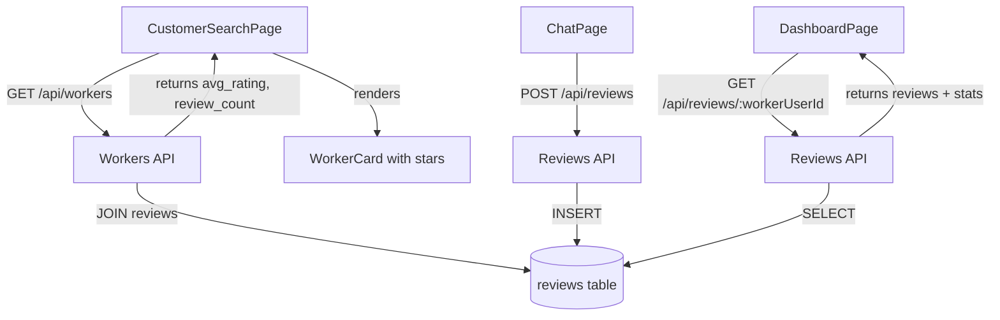
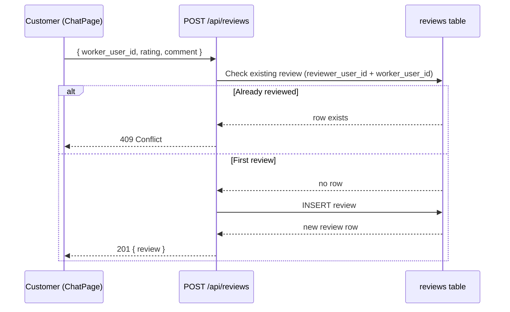
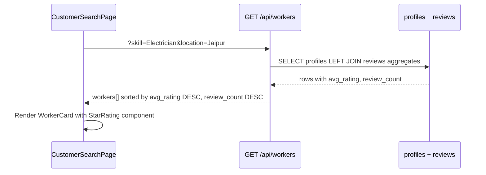

# Design Document: Worker Reviews & Ratings

## Overview

Workers in KaamlyTwo can be reviewed and rated (1–5 stars) by customers who have had a conversation with them. Reviews are displayed on worker cards in search results, and search results are sorted by average rating and review count so higher-rated workers surface first. Workers can also see their own rating on their dashboard.

## Architecture



## Sequence Diagrams

### Customer Leaves a Review from Chat



### Search Results with Ratings



## Components and Interfaces

### Backend: Reviews Route (`/api/reviews`)

**POST /api/reviews** — Create a review (customer only, auth required)

Request body:
```typescript
{
  worker_user_id: number   // user.id of the worker being reviewed
  rating: number           // 1–5 integer
  comment?: string         // optional, max 500 chars
}
```

Response `201`:
```typescript
{
  review: {
    id: number
    worker_user_id: number
    reviewer_user_id: number
    rating: number
    comment: string | null
    created_at: string
  }
}
```

**GET /api/reviews/:workerUserId** — Get all reviews for a worker (public)

Response `200`:
```typescript
{
  reviews: Review[]
  stats: {
    avg_rating: number   // rounded to 1 decimal
    review_count: number
  }
}
```

### Frontend: `StarRating` Component

```typescript
interface StarRatingProps {
  rating: number        // avg rating (e.g. 4.3)
  count: number         // review count
  size?: 'sm' | 'md'   // default 'sm'
}
```

Renders filled/half/empty stars + "(N reviews)" label.

### Frontend: Updated `WorkerResult` type

```typescript
interface WorkerResult {
  id: number
  user_id: number
  name: string
  photo_url: string | null
  location: string | null
  skills: WorkerSkill[]
  avg_rating: number       // NEW
  review_count: number     // NEW
}
```

### Frontend: `ReviewModal` Component

```typescript
interface ReviewModalProps {
  workerUserId: number
  workerName: string
  onSubmit: (rating: number, comment: string) => Promise<void>
  onClose: () => void
}
```

Shown from ChatPage header menu or after conversation is created. Contains a 5-star tap selector and optional comment textarea.

## Data Models

### `reviews` Table

```sql
CREATE TABLE IF NOT EXISTS reviews (
  id               INTEGER PRIMARY KEY AUTOINCREMENT,
  worker_user_id   INTEGER NOT NULL,
  reviewer_user_id INTEGER NOT NULL,
  rating           INTEGER NOT NULL CHECK(rating BETWEEN 1 AND 5),
  comment          TEXT,
  created_at       TEXT NOT NULL DEFAULT (datetime('now')),
  UNIQUE(worker_user_id, reviewer_user_id),
  FOREIGN KEY (worker_user_id)   REFERENCES users(id) ON DELETE CASCADE,
  FOREIGN KEY (reviewer_user_id) REFERENCES users(id) ON DELETE CASCADE
);

CREATE INDEX IF NOT EXISTS idx_reviews_worker ON reviews(worker_user_id);
```

**Validation Rules:**
- `rating` must be integer 1–5 (enforced by CHECK constraint + backend validation)
- `comment` optional, max 500 characters
- One review per (worker_user_id, reviewer_user_id) pair (UNIQUE constraint)
- Reviewer must be authenticated and must not be the worker themselves

## Key Functions with Formal Specifications

### `createReview(reviewerId, body)`

```typescript
function createReview(reviewerId: number, body: CreateReviewBody): Review
```

**Preconditions:**
- `reviewerId` is a valid authenticated user id
- `body.worker_user_id` exists in `users` table with role `'worker'`
- `body.rating` is integer in [1, 5]
- `reviewerId !== body.worker_user_id`
- No existing row in `reviews` with same `(worker_user_id, reviewer_user_id)`

**Postconditions:**
- New row inserted in `reviews`
- Returns the inserted review object
- If UNIQUE constraint violated → throws 409 error

**Loop Invariants:** N/A

### `getWorkerReviews(workerUserId)`

```typescript
function getWorkerReviews(workerUserId: number): { reviews: Review[], stats: ReviewStats }
```

**Preconditions:**
- `workerUserId` is a valid integer

**Postconditions:**
- Returns all reviews for that worker ordered by `created_at DESC`
- `stats.avg_rating` = `AVG(rating)` rounded to 1 decimal, or `0` if no reviews
- `stats.review_count` = total count of reviews

### Workers search query (updated)

```sql
SELECT
  p.id, p.user_id, p.name, p.photo_path, p.location,
  ROUND(COALESCE(AVG(r.rating), 0), 1) AS avg_rating,
  COUNT(r.id) AS review_count
FROM profiles p
LEFT JOIN reviews r ON r.worker_user_id = p.user_id
WHERE p.is_complete = 1
  [AND skill/location filters]
GROUP BY p.id
ORDER BY avg_rating DESC, review_count DESC
```

**Postconditions:**
- Workers with no reviews get `avg_rating = 0`, `review_count = 0`
- Ordering: highest avg_rating first; ties broken by review_count

## Example Usage

```typescript
// Customer submits a review from ChatPage
await reviewService.createReview({
  worker_user_id: 42,
  rating: 5,
  comment: 'Bahut acha kaam kiya!'
})

// Fetch reviews for worker dashboard
const { reviews, stats } = await reviewService.getWorkerReviews(42)
// stats = { avg_rating: 4.7, review_count: 13 }

// WorkerCard renders rating
<StarRating rating={worker.avg_rating} count={worker.review_count} />
// → ★★★★½  4.7 (13 reviews)
```

## Error Handling

### Duplicate Review
- **Condition**: Customer tries to review the same worker twice
- **Response**: `409 Conflict` with `{ message: "Aapne pehle se review de diya hai" }`
- **Recovery**: Frontend hides the "Leave Review" button if review already submitted (check via GET /api/reviews/:workerUserId before showing modal)

### Self-Review Attempt
- **Condition**: Worker tries to review themselves
- **Response**: `403 Forbidden` with `{ message: "Aap apna khud review nahi de sakte" }`

### Invalid Rating
- **Condition**: `rating` outside 1–5 or non-integer
- **Response**: `400 Bad Request` with `{ message: "Rating 1 se 5 ke beech honi chahiye" }`

### Worker Not Found
- **Condition**: `worker_user_id` doesn't exist or isn't a worker
- **Response**: `404 Not Found`

## Correctness Properties

*A property is a characteristic or behavior that should hold true across all valid executions of a system — essentially, a formal statement about what the system should do. Properties serve as the bridge between human-readable specifications and machine-verifiable correctness guarantees.*

### Property 1: Valid review creation round-trip

*For any* valid rating integer in [1, 5] and any optional comment string of at most 500 characters, submitting a review via `POST /api/reviews` and then fetching via `GET /api/reviews/:workerUserId` should return a reviews list that contains a review with the same rating and comment.

**Validates: Requirements 1.1, 4.1**

### Property 2: Invalid rating rejection

*For any* rating value that is not an integer in [1, 5] (e.g. 0, 6, -1, 3.5, null), `POST /api/reviews` should return HTTP 400.

**Validates: Requirements 1.2**

### Property 3: Duplicate review rejection

*For any* valid first review submission, a second submission with the same `(reviewer_user_id, worker_user_id)` pair should return HTTP 409 regardless of the rating or comment values.

**Validates: Requirements 1.3, 7.1**

### Property 4: Self-review rejection

*For any* authenticated user, submitting a review where `worker_user_id` equals the authenticated user's own `id` should return HTTP 403.

**Validates: Requirements 1.4, 6.1**

### Property 5: Comment length validation

*For any* comment string whose length exceeds 500 characters, `POST /api/reviews` should return HTTP 400.

**Validates: Requirements 1.5**

### Property 6: WorkerCard renders rating and count

*For any* `WorkerResult` object with arbitrary `avg_rating` and `review_count` values, the rendered `WorkerCard` output should contain a string representation of `avg_rating` and a string representation of `review_count`.

**Validates: Requirements 2.1, 2.2**

### Property 7: Search results sort order

*For any* set of workers returned by `GET /api/workers`, the result array should be sorted such that for every adjacent pair `results[i]` and `results[i+1]`, `results[i].avg_rating >= results[i+1].avg_rating`, and when `results[i].avg_rating === results[i+1].avg_rating`, `results[i].review_count >= results[i+1].review_count`.

**Validates: Requirements 3.1, 3.2**

### Property 8: Worker reviews ordered by date

*For any* worker with multiple reviews, `GET /api/reviews/:workerUserId` should return reviews such that for every adjacent pair `reviews[i]` and `reviews[i+1]`, `reviews[i].created_at >= reviews[i+1].created_at`.

**Validates: Requirements 4.1**

### Property 9: Review stats aggregation correctness

*For any* set of N reviews with ratings r₁…rN all in [1, 5], the `stats` object returned by `GET /api/reviews/:workerUserId` should satisfy `stats.review_count === N` and `stats.avg_rating === round(sum(r₁…rN) / N, 1)`. When N = 0, `stats.avg_rating === 0` and `stats.review_count === 0`.

**Validates: Requirements 4.2, 4.3**

### Property 10: Review button hidden after submission

*For any* ChatPage rendered with `hasReviewed = true` for the current worker, the "Leave Review" button should not be present in the rendered output.

**Validates: Requirements 5.2**

## Testing Strategy

### Unit Testing

- `createReview` rejects duplicate (worker_user_id, reviewer_user_id)
- `createReview` rejects self-review
- `createReview` rejects rating outside 1–5
- `getWorkerReviews` returns `avg_rating: 0` when no reviews exist
- Workers search returns results sorted by avg_rating DESC, review_count DESC

### Property-Based Testing

**Property Test Library**: fast-check

- See Correctness Properties section above for all 10 properties

### Integration Testing

- POST /api/reviews → GET /api/reviews/:id reflects new review in stats
- GET /api/workers returns updated avg_rating after a new review is posted
- Duplicate POST returns 409

## Performance Considerations

- `idx_reviews_worker` index on `reviews(worker_user_id)` keeps the LEFT JOIN fast
- `AVG` and `COUNT` are computed in a single GROUP BY query — no N+1
- Review count is small per worker in early stage; no caching needed initially

## Security Considerations

- POST /api/reviews requires JWT auth middleware — unauthenticated users cannot post
- Backend validates `reviewerId !== worker_user_id` to prevent self-reviews
- `comment` is stored as plain text; XSS prevention is handled at render time by React's default escaping
- Rating CHECK constraint is enforced at DB level as a second line of defense

## Dependencies

- `better-sqlite3` — already in use, no new deps needed
- `fast-check` — for property-based tests (dev dependency)
- No new frontend libraries needed; star rendering uses Unicode characters (★ ☆)
